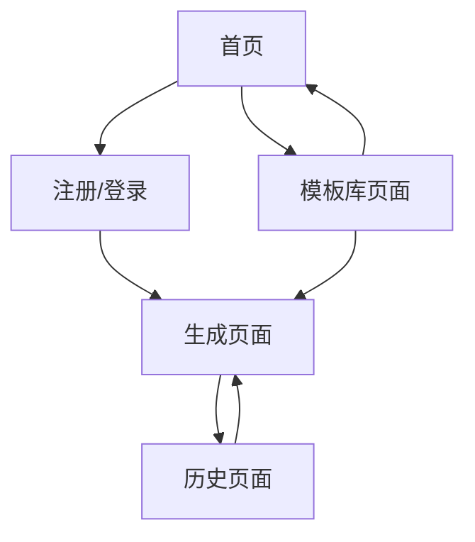

# 文生视界(TextVision) 产品需求文档

## 1. 产品概述

文生视界(TextVision)是一个专注于AI图文生成的Web应用，用户可以通过文本描述生成高质量的图片和视频内容。
- 解决用户快速创建视觉内容的需求，降低创作门槛，提供丰富的模板库和参考图功能，让每个人都能轻松创作出专业级的视觉作品。
- 目标是成为国内领先的AI视觉内容创作平台，为个人创作者、设计师、营销人员提供高效的创作工具。

## 2. 核心功能

### 2.1 用户角色

| 角色 | 注册方式 | 核心权限 |
|------|----------|----------|
| 普通用户 | 邮箱/手机号注册 | 可生成图片视频、使用模板、查看历史记录 |
| 默认用户 | 无需注册 | 可体验基础生成功能，限制使用次数 |

### 2.2 功能模块

我们的文生视界应用包含以下主要页面：
1. **首页**：产品介绍、功能展示、用户注册登录入口、模板库预览展示
2. **生成页面**：文本输入、参考图上传、图片视频生成功能
3. **历史页面**：生成记录查看、内容下载管理
4. **模板库页面**：分类模板浏览、模板应用功能

### 2.3 页面详情

| 页面名称 | 模块名称 | 功能描述 |
|----------|----------|----------|
| 首页 | 产品介绍区 | 展示产品核心功能、特色亮点，包含hero区域和功能说明 |
| 首页 | 用户认证区 | 提供注册、登录入口，支持邮箱和手机号注册 |
| 首页 | 模板展示区 | 双行瀑布流展示热门模板，支持横向循环滚动 |
| 生成页面 | 文本输入区 | 支持多行文本输入，提供提示词建议和优化 |
| 生成页面 | 参考图上传 | 支持图片拖拽上传，预览和编辑功能 |
| 生成页面 | 生成控制区 | 选择生成类型(图片/视频)、尺寸、风格等参数 |
| 生成页面 | 结果展示区 | 实时显示生成进度，展示生成结果，提供下载和保存 |
| 历史页面 | 记录列表 | 按时间展示所有生成记录，支持筛选和搜索 |
| 历史页面 | 内容管理 | 批量选择、删除、下载生成的图片视频 |
| 模板库页面 | 分类导航 | 动态加载数据库存储的分类，支持后端筛选和分页 |
| 模板库页面 | 模板详情 | 展示模板预览、提示词、应用按钮，关联分类信息 |
| 模板库页面 | 分类管理 | 管理员可添加、编辑、删除模板分类，设置分类排序 |

## 3. 核心流程

**主要用户操作流程：**
用户访问首页了解产品功能 → 注册登录账户 → 进入生成页面输入文本或上传参考图 → 选择生成参数并开始生成 → 查看生成结果并下载保存 → 在历史页面管理所有创作内容。

**模板使用流程：**
用户在首页或模板库页面浏览模板 → 选择心仪模板查看详情 → 点击应用模板跳转到生成页面 → 基于模板提示词进行个性化调整 → 生成专属内容。



## 4. 数据库设计

### 4.1 新增表结构

#### 模板分类表 (template_category)
```sql
CREATE TABLE `template_category` (
  `id` BIGINT AUTO_INCREMENT PRIMARY KEY COMMENT '分类ID',
  `name` VARCHAR(50) NOT NULL COMMENT '分类名称',
  `description` VARCHAR(200) COMMENT '分类描述',
  `icon` VARCHAR(100) COMMENT '分类图标',
  `sort_order` INT DEFAULT 0 COMMENT '排序权重',
  `status` TINYINT DEFAULT 1 COMMENT '状态：0-禁用，1-启用',
  `created_at` TIMESTAMP DEFAULT CURRENT_TIMESTAMP COMMENT '创建时间',
  `updated_at` TIMESTAMP DEFAULT CURRENT_TIMESTAMP ON UPDATE CURRENT_TIMESTAMP COMMENT '更新时间',
  `deleted` TINYINT DEFAULT 0 COMMENT '逻辑删除：0-未删除，1-已删除',
  UNIQUE KEY `uk_name` (`name`)
) ENGINE=InnoDB DEFAULT CHARSET=utf8mb4 COMMENT='模板分类表';
```

#### 模板表结构修改
- 将 `category` 字段改为 `category_id` BIGINT 类型
- 添加外键关联到 `template_category` 表
- 保持向后兼容，支持数据迁移

### 4.2 初始化数据
```sql
-- 插入默认分类
INSERT INTO `template_category` (`name`, `description`, `icon`, `sort_order`) VALUES
('风景', '自然风光、城市景观等风景类模板', 'landscape', 1),
('人像', '人物肖像、艺术摄影等人像类模板', 'user', 2),
('艺术', '抽象艺术、创意设计等艺术类模板', 'palette', 3),
('视频', '动态视频、动画效果等视频类模板', 'video', 4),
('商业', '产品展示、营销推广等商业类模板', 'briefcase', 5);
```

### 4.3 数据迁移策略
1. 创建新的分类表并插入初始数据
2. 为现有模板数据匹配对应的分类ID
3. 更新模板表结构，添加category_id字段
4. 逐步迁移数据，确保数据完整性
5. 验证迁移结果后删除旧的category字段

## 5. 技术实现要求

### 5.1 后端API更新
- **分类管理API**: 提供分类的增删改查接口
- **模板查询优化**: 修改模板查询逻辑，支持分类ID筛选
- **数据库查询优化**: 使用JOIN查询获取分类信息，避免N+1问题
- **缓存策略**: 对分类数据进行缓存，提高查询性能

### 5.2 前端功能更新
- **分类数据获取**: 从后端API动态获取分类列表
- **筛选逻辑重构**: 移除前端筛选，改为调用后端筛选接口
- **分类管理界面**: 为管理员提供分类管理功能（可选）
- **用户体验优化**: 保持筛选操作的流畅性和响应速度

### 5.3 性能优化
- **索引优化**: 为category_id字段添加索引
- **分页查询**: 支持分类筛选的分页查询
- **缓存机制**: 缓存热门分类和模板数据
- **懒加载**: 分类数据懒加载，减少初始加载时间

## 6. 用户界面设计

### 6.1 设计风格

- **主色调**：奶白色(#FEFEFE)、雾紫色(#E6E0F8)、淡蓝色(#E8F4FD)
- **辅助色**：柔和粉色(#F5E6FF)、薄荷绿(#E8F8F5)
- **按钮风格**：圆角矩形，具有果冻感的渐变效果，悬停时有柔和的缩放动画
- **字体**：主标题使用苹方/思源黑体 24-32px，正文使用14-16px，确保清晰易读
- **布局风格**：卡片式设计，大量留白，柔和的阴影效果，整体呈现疗愈感
- **图标风格**：线性图标配合柔和的填充色，统一的圆角处理

### 6.2 页面设计概览

| 页面名称 | 模块名称 | UI元素 |
|----------|----------|--------|
| 首页 | 产品介绍区 | 大尺寸hero图，渐变背景(奶白到淡蓝)，柔和的文字动画，圆角卡片展示功能特色 |
| 首页 | 模板展示区 | 双行瀑布流布局，卡片阴影效果，无限循环滚动动画，悬停放大效果 |
| 生成页面 | 文本输入区 | 大尺寸圆角输入框，雾紫色边框，柔和的聚焦动画，字数统计显示 |
| 生成页面 | 结果展示区 | 居中卡片布局，加载时的呼吸动画，结果展示的淡入效果 |
| 历史页面 | 记录列表 | 网格布局，每个项目为圆角卡片，悬停时轻微上浮效果，柔和的过渡动画 |
| 模板库页面 | 分类导航 | 横向标签栏，选中状态有柔和的背景色变化，平滑的切换动画 |

### 6.3 响应式设计

产品采用移动端优先的响应式设计，支持桌面端、平板和手机端的完美适配，针对触屏设备优化了交互体验，确保在各种设备上都能提供流畅的操作体验。