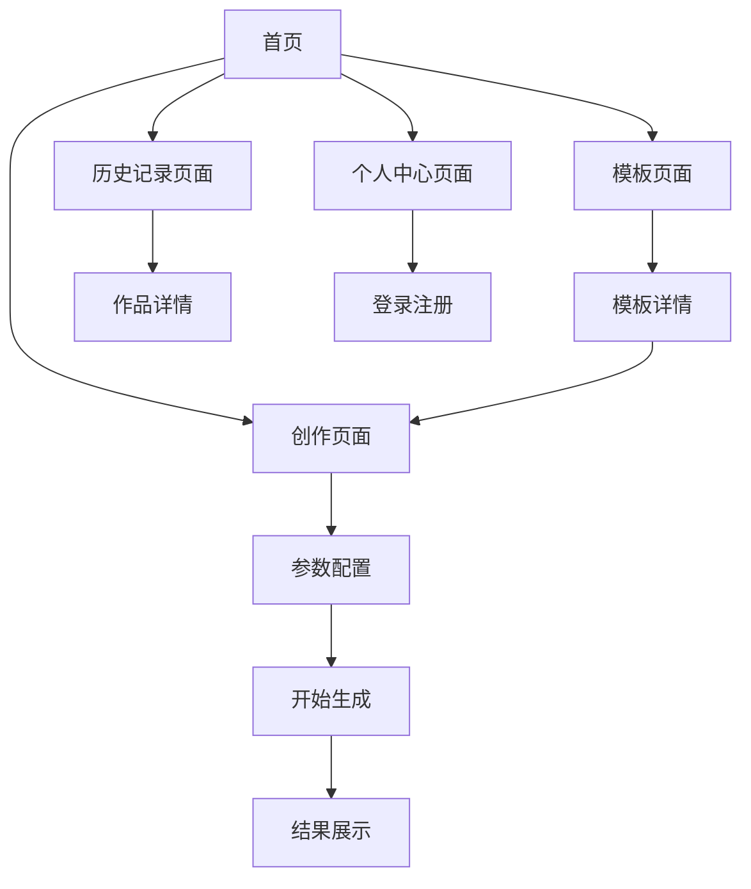

# 文生视界移动端产品需求文档

## 1. Product Overview
文生视界移动端是一款基于AI技术的图文生成应用，为用户提供便捷的移动端创作体验。用户可以通过简单的文字描述，快速生成高质量的图片和视频内容。
- 解决移动端用户随时随地进行AI创作的需求，让创意不受时间和地点限制
- 目标是成为移动端最受欢迎的AI创作工具，为用户提供专业级的创作体验

## 2. Core Features

### 2.1 User Roles
| Role | Registration Method | Core Permissions |
|------|---------------------|------------------|
| 普通用户 | 邮箱注册登录 | 注册登录后可使用应用的全部功能，包括图文生成、高级参数配置、模板使用、历史记录管理等所有特性 |

### 2.2 Feature Module
我们的移动端应用包含以下主要页面：
1. **首页**：应用介绍、快速入口、热门模板展示
2. **创作页面**：文字输入、参数配置、生成功能
3. **历史记录页面**：查看、管理、下载历史作品
4. **模板页面**：浏览、搜索、使用创作模板
5. **个人中心页面**：用户信息、设置、登录注册

### 2.3 Page Details
| Page Name | Module Name | Feature description |
|-----------|-------------|---------------------|
| 首页 | 应用介绍区 | 展示应用核心功能和特色，吸引用户使用 |
| 首页 | 快速创作入口 | 提供快速进入创作页面的便捷入口 |
| 首页 | 热门模板轮播 | 展示精选热门模板，支持滑动浏览和快速应用 |
| 创作页面 | 文字输入区 | 支持多行文本输入，实时字数统计，输入建议 |
| 创作页面 | 内容类型选择 | 支持图片/视频类型切换，动态显示对应参数 |
| 创作页面 | 艺术风格选择 | 提供多种艺术风格选项，支持预览和快速切换 |
| 创作页面 | 参考图片上传 | 支持拍照或相册选择，图片预览和删除功能 |
| 创作页面 | 图片参数配置 | 尺寸选择(1024x1024等5种)、质量选择、随机种子、引导比例设置 |
| 创作页面 | 视频参数配置 | 分辨率(480p/720p/1080p)、时长(5s/10s)、画面比例(6种)、帧率、固定摄像头、CFG比例、生成数量 |
| 创作页面 | 水印设置 | 开关控制是否添加水印到生成内容 |
| 创作页面 | 生成按钮 | 执行内容生成，显示进度和状态反馈 |
| 创作页面 | 结果展示区 | 显示生成结果，支持预览、下载、分享操作 |
| 历史记录页面 | 内容列表 | 瀑布流展示历史作品，支持下拉刷新和上拉加载 |
| 历史记录页面 | 筛选功能 | 按类型(图片/视频)、时间筛选历史内容 |
| 历史记录页面 | 操作功能 | 支持查看详情、重新生成、下载、分享、删除 |
| 模板页面 | 分类导航 | 横向滑动的分类标签，支持快速切换 |
| 模板页面 | 模板网格 | 网格布局展示模板，包含预览图和基本信息 |
| 模板页面 | 搜索功能 | 支持关键词搜索模板，实时搜索建议 |
| 模板页面 | 模板详情 | 显示模板详细信息，一键应用到创作页面 |
| 个人中心页面 | 用户信息 | 显示头像、昵称、邮箱等基本信息 |
| 个人中心页面 | 登录注册 | 邮箱登录注册表单，支持密码找回 |
| 个人中心页面 | 设置选项 | 应用设置、主题切换、关于我们等功能 |

## 3. Core Process

### 用户操作流程
用户打开应用后，可以直接浏览首页内容和热门模板。注册登录后，用户可以进入创作页面输入描述文字，选择生成类型和参数配置（包括高级参数如随机种子、引导比例等），上传参考图片，点击生成按钮开始创作。生成完成后可以预览、下载或分享作品。用户可以在历史记录页面查看所有创作历史，在模板页面浏览和使用各种创作模板，享受应用的全部功能特性。

## 4. User Interface Design

### 4.1 Design Style
- **主色调**：奶白色(#FEFEFE)作为主背景，雾紫色(#E8E2F0)作为次要背景，淡蓝色(#E3F2FD)作为点缀色
- **按钮样式**：圆角矩形设计，具有轻微的阴影和渐变效果，营造果冻般的质感
- **字体**：主标题使用18-24px，正文使用14-16px，采用系统默认字体确保清晰度
- **布局风格**：卡片式设计，大量留白，垂直滚动为主，符合移动端操作习惯
- **图标风格**：线性图标配合圆角设计，颜色柔和，支持主题色彩变化
- **动效**：使用缓动函数(ease-out)，动画时长控制在200-400ms，营造柔和自然的交互体验

### 4.2 Page Design Overview

| Page Name | Module Name | UI Elements |
|-----------|-------------|-------------|
| 首页 | 应用介绍区 | 渐变背景(奶白到雾紫)，大标题使用渐变文字效果，柔和的插图元素 |
| 首页 | 快速创作入口 | 圆角卡片设计，淡蓝色背景，轻微阴影，点击时有缩放动效 |
| 首页 | 热门模板轮播 | 横向滑动卡片，圆角设计，半透明背景，平滑滑动动画 |
| 创作页面 | 文字输入区 | 大圆角输入框，雾紫色边框，聚焦时边框颜色变为淡蓝色 |
| 创作页面 | 参数配置区 | 可折叠卡片设计，展开收起有平滑动画，参数项使用圆角开关和选择器 |
| 创作页面 | 生成按钮 | 大圆角按钮，渐变背景(雾紫到淡蓝)，生成时有呼吸动画效果 |
| 创作页面 | 结果展示区 | 圆角图片容器，加载时有骨架屏动画，操作按钮悬浮显示 |
| 历史记录页面 | 内容列表 | 瀑布流布局，圆角卡片，轻微阴影，滑动时有视差效果 |
| 模板页面 | 分类导航 | 横向滚动标签，选中状态有背景色变化和下划线动画 |
| 模板页面 | 模板网格 | 2列网格布局，圆角卡片，悬停时有轻微放大效果 |
| 个人中心页面 | 用户信息 | 圆形头像，渐变背景，信息卡片使用半透明设计 |

### 4.3 Responsiveness
移动端优先设计，支持竖屏和横屏自适应。针对不同屏幕尺寸(4.7寸到6.7寸)进行优化，确保在各种设备上都有良好的显示效果。支持触摸手势操作，如滑动、长按、双击等，提供符合移动端用户习惯的交互体验。所有交互元素都考虑了手指触摸的最小尺寸要求(44px)。