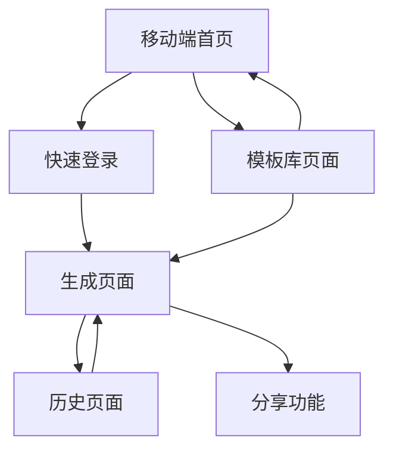

# 文生视界移动端Web应用产品需求文档

## 1. 产品概述

文生视界移动端是专为移动设备优化的AI图文生成Web应用，提供与PC端完全一致的功能体验，但采用移动端专属的交互设计和视觉风格。

* 解决移动用户随时随地创作视觉内容的需求，通过触屏友好的界面和柔和疗愈的设计风格，为用户提供放松舒缓的创作体验。

* 目标是成为移动端领先的AI视觉内容创作平台，让用户在碎片化时间内也能轻松创作出专业级的视觉作品。

## 2. 核心功能

### 2.1 用户角色

| 角色   | 注册方式 | 核心权限                |
| ---- | ---- | ------------------- |
| 注册用户 | 邮箱注册 | 可生成图片视频、使用模板、查看历史记录 |

### 2.2 功能模块

我们的移动端文生视界应用包含以下主要页面：

1. **移动端首页**：产品介绍、功能展示、用户注册登录入口、精选模板展示
2. **移动端生成页面**：触屏优化的文本输入、参考图上传、图片视频生成功能（需登录）
3. **移动端历史页面**：生成记录查看、内容下载管理、分享功能（需登录）
4. **移动端模板库页面**：分类模板浏览、模板应用功能（需登录）
5. **登录注册页面**：邮箱注册、用户登录、密码找回
6. **底部导航栏**：首页、生成、模板、历史四个主要功能入口

### 2.3 页面详情

| 页面名称     | 模块名称   | 功能描述                         |
| -------- | ------ | ---------------------------- |
| 移动端首页    | Hero区域 | 全屏渐变背景展示，柔和动画效果，产品核心功能介绍     |
| 移动端首页    | 快速登录区  | 大按钮设计，支持手机号快速登录、微信登录等第三方登录   |
| 移动端首页    | 精选模板   | 横向滑动卡片展示，支持手势滑动浏览热门模板        |
| 移动端生成页面  | 触屏文本输入 | 大尺寸输入框，智能键盘适配，语音输入支持         |
| 移动端生成页面  | 图片上传区  | 拖拽上传优化，相机拍照、相册选择，图片预览编辑      |
| 移动端生成页面  | 参数选择区  | 滑动选择器，触屏友好的参数调节，折叠式高级设置      |
| 移动端生成页面  | 结果展示区  | 全屏预览模式，双指缩放，一键分享和下载          |
| 移动端历史页面  | 记录网格   | 瀑布流布局，无限滚动加载，长按多选操作          |
| 移动端历史页面  | 内容管理   | 滑动删除，批量操作，云端同步状态显示           |
| 移动端模板库页面 | 分类标签   | 横向滚动标签栏，触屏友好的分类切换            |
| 移动端模板库页面 | 模板卡片   | 大尺寸预览图，点击查看详情，一键应用到生成页面      |
| 底部导航栏    | 导航菜单   | 四个主要功能入口：首页、生成、模板、历史，图标+文字设计 |
| 底部导航栏    | 交互效果   | 选中状态高亮，切换动画，触觉反馈，固定底部显示      |

## 3. 核心流程

**移动端用户操作流程：**
用户访问移动端首页了解产品 → 邮箱注册并登录账户 → 通过底部导航进入生成页面 → 输入文本或拍照上传 → 通过触屏友好的界面选择生成参数 → 查看全屏预览结果并分享保存 → 在历史页面管理所有创作内容。

**移动端模板使用流程：**
用户登录后在模板库页面浏览模板 → 点击模板查看详情预览 → 一键应用跳转到生成页面 → 基于模板进行个性化调整 → 生成并分享专属内容。

**底部导航流程：**
用户通过底部导航栏快速切换功能页面 → 首页（产品介绍）、生成（创作功能）、模板（模板库）、历史（记录管理）四个核心功能一键直达。

## 4. 用户界面设计

### 4.1 移动端设计风格

* **主色调**：奶白色(#FEFEFE)、雾紫色(#E6E0F8)、淡蓝色(#E8F4FD)

* **辅助色**：柔和粉色(#F5E6FF)、薄荷绿(#E8F8F5)、温暖橙(#FFF2E6)

* **按钮风格**：大尺寸圆角按钮，果冻感渐变效果，触摸反馈动画，最小44px触摸区域

* **字体**：移动端优化字体 16-20px正文，24-28px标题，确保在小屏幕上清晰易读

* **布局风格**：单列布局为主，大间距设计，柔和阴影和圆角，疗愈感的视觉层次

* **图标风格**：线性图标配合柔和填充，统一24px尺寸，适配高分辨率屏幕

### 4.2 移动端页面设计概览

| 页面名称     | 模块名称   | UI元素                                   |
| -------- | ------ | -------------------------------------- |
| 移动端首页    | Hero区域 | 全屏渐变背景(奶白到淡蓝)，柔和粒子动画，大标题居中布局，向上滑动引导    |
| 移动端首页    | 精选模板   | 横向滑动卡片，圆角设计，轻微阴影，滑动指示器，无限循环滚动          |
| 移动端生成页面  | 文本输入区  | 全宽圆角输入框，雾紫色聚焦边框，字数统计，语音输入按钮            |
| 移动端生成页面  | 参数选择   | 滑动选择器，触觉反馈，折叠面板，预设快捷选项                 |
| 移动端生成页面  | 结果展示   | 全屏预览模式，双指缩放，底部操作栏，分享按钮突出显示             |
| 移动端历史页面  | 记录网格   | 两列瀑布流，圆角卡片，长按选择模式，滑动删除手势               |
| 移动端模板库页面 | 分类导航   | 横向滚动标签，选中状态圆角背景，平滑切换动画                 |
| 底部导航栏    | 导航设计   | 固定底部，高度56px，奶白色背景，柔和阴影，四等分布局           |
| 底部导航栏    | 图标设计   | 线性图标24px，选中时填充色变化，雾紫色主题，果冻感动效          |
| 底部导航栏    | 文字标签   | 12px字体，选中时雾紫色(#E6E0F8)，未选中时灰色(#999999) |
| 底部导航栏    | 交互效果   | 点击时0.2s缩放动画，切换时淡入淡出，触觉反馈，选中指示器         |

### 4.3 底部导航栏详细设计

**导航项目配置：**

* **首页**：图标为home线性图标，点击返回产品介绍页面

* **生成**：图标为magic-wand线性图标，点击进入内容生成页面（需登录）

* **模板**：图标为grid线性图标，点击进入模板库页面（需登录）

* **历史**：图标为clock线性图标，点击进入历史记录页面（需登录）

**视觉设计规范：**

* 背景色：奶白色(#FEFEFE)，顶部1px雾紫色边框

* 选中状态：图标和文字变为雾紫色(#E6E0F8)，添加柔和发光效果

* 未选中状态：图标和文字为中性灰色(#999999)

* 安全区域：适配iPhone底部安全区域，增加额外padding

**交互动效设计：**

* 点击动画：0.2s ease-out缩放动画(scale 0.95 → 1.0)

* 切换动画：选中指示器0.3s ease-in-out移动动画

* 触觉反馈：iOS设备支持轻微震动反馈

* 防误触：200ms防抖处理，避免快速连续点击

### 4.4 移动端交互设计

**触屏优化：**

* 所有可点击元素最小44px触摸区域

* 支持手势操作：滑动、长按、双指缩放

* 触摸反馈：轻微震动和视觉反馈

* 防误触设计：重要操作需要确认

**移动端适配：**

* 响应式布局适配各种屏幕尺寸

* 横竖屏切换优化

* 安全区域适配（刘海屏、圆角屏）

* 键盘弹出时的界面调整

## 5. 技术架构

### 5.1 移动端技术选型

**前端框架：**

* **React 18** + **TypeScript**：现代化开发体验

* **Vite**：快速构建和热更新

* **PWA支持**：离线缓存和原生应用体验

**移动端专用库：**

* **React Touch**：触摸手势处理

* **Framer Motion**：流畅动画效果

* **React Spring**：物理动画库

* **Hammer.js**：手势识别

**UI组件库：**

* **Ant Design Mobile**：移动端组件基础

* **自定义组件**：符合设计风格的定制组件

* **React Virtualized**：长列表性能优化

**移动端优化：**

* **Workbox**：PWA和缓存策略

* **React Lazy**：代码分割和懒加载

* **Image Optimization**：图片压缩和WebP支持

* **Touch Events**：触摸事件优化

### 5.2 移动端性能优化

**加载优化：**

* 首屏加载时间控制在2秒内

* 图片懒加载和渐进式加载

* 关键资源预加载

* 代码分割和按需加载

**交互优化：**

* 触摸响应时间小于100ms

* 滚动性能优化，60fps流畅滚动

* 动画使用GPU加速

* 防抖和节流优化

**网络优化：**

* 接口请求合并和缓存

* 离线功能支持

* 弱网环境优化

* 图片CDN和压缩

### 5.3 移动端兼容性

**浏览器支持：**

* iOS Safari 12+

* Android Chrome 70+

* 微信内置浏览器

* 支付宝内置浏览器

**设备适配：**

* iPhone 6及以上设备

* Android 8.0及以上系统

* 平板设备横竖屏适配

* 高分辨率屏幕支持

## 6. 移动端特色功能

### 6.1 移动端专属功能

**相机集成：**

* 直接调用相机拍照作为参考图

* 实时预览和滤镜效果

* 图片编辑和裁剪功能

**语音输入：**

* 语音转文字输入prompt

* 多语言语音识别

* 语音输入优化和纠错

**分享功能：**

* 一键分享到社交平台

* 生成分享海报

* 二维码分享功能

**离线功能：**

* 历史记录离线查看

* 模板离线缓存

* 网络恢复后自动同步

### 6.2 移动端用户体验

**快速操作：**

* 一键生成快捷按钮

* 常用参数预设

* 历史参数记忆

* 模板快速应用

**个性化体验：**

* 深色模式支持

* 字体大小调节

* 操作习惯学习

* 个性化推荐

**无障碍设计：**

* 屏幕阅读器支持

* 高对比度模式

* 大字体模式

* 语音导航支持

## 7. 开发计划

### 7.1 开发阶段

**第一阶段（2周）：**

* 移动端项目初始化和技术架构搭建

* 基础组件库开发

* 移动端首页开发

**第二阶段（3周）：**

* 生成页面移动端适配

* 触屏交互优化

* 相机和语音功能集成

**第三阶段（2周）：**

* 历史页面和模板库移动端开发

* 分享功能实现

* 性能优化和测试

**第四阶段（1周）：**

* PWA功能完善

* 兼容性测试

* 上线部署

### 7.2 测试计划

**功能测试：**

* 各页面功能完整性测试

* 触屏交互测试

* 兼容性测试

**性能测试：**

* 加载速度测试

* 内存使用测试

* 电池消耗测试

**用户体验测试：**

* 可用性测试

* 无障碍测试

* 真机测试

## 8. 验收标准

1. ✅ 移动端功能与PC端完全一致
2. ✅ 触屏交互流畅，响应时间小于100ms
3. ✅ 设计风格柔和疗愈，符合品牌调性
4. ✅ 支持主流移动浏览器和设备
5. ✅ 首屏加载时间小于2秒
6. ✅ PWA功能正常，支持离线使用
7. ✅ 相机、语音、分享等移动端特色功能正常
8. ✅ 无障碍功能完善，用户体验优秀

