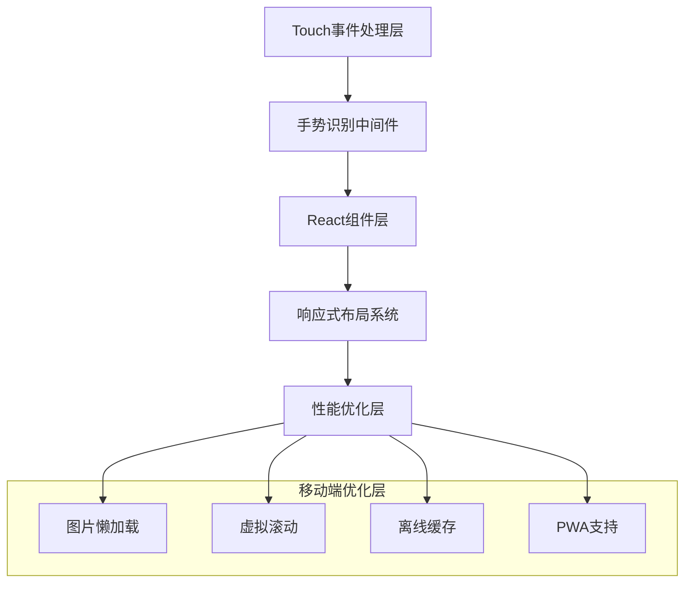

# 文生视界移动端技术架构文档

## 1. Architecture design

```CQL
graph TD
    A[移动端浏览器] --> B[React Native Web / Vite PWA]
    B --> C[Zustand状态管理]
    B --> D[Axios HTTP客户端]
    D --> E[后端API服务]
    
    subgraph "前端层 (Mobile Optimized)"
        B
        C
        F[Framer Motion动画]
        G[Tailwind CSS响应式]
        H[Touch手势处理]
    end
    
    subgraph "后端服务层 (复用PC端)"
        E
        I[用户认证服务]
        J[内容生成服务]
        K[模板管理服务]
    end
    
    subgraph "数据存储层"
        L[MySQL数据库]
        M[文件存储服务]
    end
    
    E --> L
    E --> M
end
```

## 2. Technology Description

* Frontend: React\@18 + TypeScript + Vite + PWA

* UI Framework: Tailwind CSS\@3 + Framer Motion\@10

* State Management: Zustand\@4

* HTTP Client: Axios\@1.6

* Mobile Optimization: React Native Web (可选) + Touch手势库

* Build Tool: Vite\@5 + PWA插件

* Backend: 复用现有PC端API服务

## 3. Route definitions

| Route      | Purpose            |
| ---------- | ------------------ |
| /          | 首页，展示应用介绍和快速入口     |
| /create    | 创作页面，提供图文生成功能和参数配置 |
| /history   | 历史记录页面，展示用户的创作历史   |
| /templates | 模板页面，浏览和使用创作模板     |
| /profile   | 个人中心页面，用户信息和设置     |
| /login     | 登录页面，用户认证          |
| /register  | 注册页面，新用户注册         |

## 4. API definitions

移动端复用PC端的所有API接口，保持完全一致的功能和参数：

### 4.1 Core API

**用户认证相关**

```
POST /api/users/login
POST /api/users/register
GET /api/users/profile
```

**内容生成相关**

```
POST /api/contents/generate
```

Request:

| Param Name     | Param Type | isRequired | Description                 |
| -------------- | ---------- | ---------- | --------------------------- |
| prompt         | string     | true       | 生成内容的文字描述                   |
| type           | string     | true       | 内容类型：'image' 或 'video'      |
| size           | string     | false      | 图片尺寸，如 '1024x1024'          |
| quality        | string     | false      | 图片质量：'standard' 或 'hd'      |
| seed           | number     | false      | 随机种子，用于复现结果                 |
| guidanceScale  | number     | false      | 引导比例，1-10之间                 |
| resolution     | string     | false      | 视频分辨率：'480p'/'720p'/'1080p' |
| duration       | number     | false      | 视频时长：5或10秒                  |
| ratio          | string     | false      | 画面比例：'1:1'/'16:9'等          |
| fps            | number     | false      | 视频帧率：12-60                  |
| cameraFixed    | boolean    | false      | 是否固定摄像头                     |
| cfgScale       | number     | false      | CFG比例                       |
| count          | number     | false      | 生成数量                        |
| styleId        | number     | false      | 艺术风格ID                      |
| watermark      | boolean    | false      | 是否添加水印                      |
| referenceImage | string     | false      | 参考图片URL                     |

Response:

| Param Name | Param Type | Description |
| ---------- | ---------- | ----------- |
| id         | string     | 生成内容的唯一标识   |
| status     | string     | 生成状态        |
| url        | string     | 生成内容的访问URL  |

**模板管理相关**

```
GET /api/templates
GET /api/templates/{id}
GET /api/template-categories
```

**历史记录相关**

```
GET /api/contents
GET /api/contents/{id}
DELETE /api/contents/{id}
```

**艺术风格相关**

```
GET /api/art-styles
GET /api/art-styles/{id}
```

## 5. Mobile-Specific Optimizations

### 5.1 移动端特有架构设计



### 5.2 移动端技术特性

* **触摸优化**：使用React Touch事件和手势库，支持滑动、长按、双击等操作

* **响应式设计**：基于Tailwind CSS的移动端优先设计，支持多种屏幕尺寸

* **性能优化**：图片懒加载、虚拟滚动、代码分割等技术提升加载速度

* **PWA支持**：支持离线使用、添加到主屏幕、推送通知等原生应用特性

* **网络优化**：请求缓存、断网重连、数据压缩等移动网络优化

## 6. Data model

### 6.1 Data model definition

移动端复用PC端的完整数据模型，包括：

```Java
erDiagram
    USER ||--o{ CONTENT : creates
    USER ||--o{ OPERATION_LOG : generates
    TEMPLATE ||--o{ CONTENT : uses
    TEMPLATE_CATEGORY ||--o{ TEMPLATE : contains
    ART_STYLE ||--o{ CONTENT : applies
    
    USER {
        int id PK
        string email
        string password_hash
        string name
        string avatar
        datetime created_at
        datetime updated_at
    }
    
    CONTENT {
        int id PK
        int user_id FK
        string prompt
        string type
        string url
        string thumbnail
        json urls
        json thumbnails
        string size
        int style_id FK
        string reference_image
        boolean watermark
        json generation_params
        string status
        datetime created_at
    }
    
    TEMPLATE {
        int id PK
        string name
        string prompt
        string type
        string preview_url
        int category_id FK
        int usage_count
        datetime created_at
    }
    
    TEMPLATE_CATEGORY {
        int id PK
        string name
        string description
        string icon
        int sort_order
        int status
    }
    
    ART_STYLE {
        int id PK
        string name
        string description
        string preview_url
        string type
        boolean enabled
        int sort_order
    }
```

### 6.2 移动端特有存储优化

**本地存储策略**

```javascript
// 使用localStorage存储用户偏好设置
const mobileSettings = {
  theme: 'light', // 主题设置
  autoSave: true, // 自动保存草稿
  imageQuality: 'standard', // 默认图片质量
  videoResolution: '720p', // 默认视频分辨率
  touchSensitivity: 'medium' // 触摸灵敏度
};

// 使用IndexedDB存储离线数据
const offlineCache = {
  templates: [], // 缓存的模板数据
  artStyles: [], // 缓存的艺术风格
  recentContents: [], // 最近的创作内容
  drafts: [] // 草稿数据
};
```

**缓存策略**

* 模板和艺术风格数据缓存7天

* 用户创作历史缓存3天

* 图片缩略图缓存1天

* API响应缓存30分钟

## 7. Deployment Strategy

### 7.1 构建配置

```javascript
// vite.config.ts - 移动端优化配置
export default defineConfig({
  plugins: [
    react(),
    VitePWA({
      registerType: 'autoUpdate',
      workbox: {
        globPatterns: ['**/*.{js,css,html,ico,png,svg,woff2}']
      },
      manifest: {
        name: '文生视界移动端',
        short_name: '文生视界',
        theme_color: '#E8E2F0',
        background_color: '#FEFEFE',
        display: 'standalone',
        orientation: 'portrait'
      }
    })
  ],
  build: {
    target: 'es2015',
    cssCodeSplit: true,
    rollupOptions: {
      output: {
        manualChunks: {
          vendor: ['react', 'react-dom'],
          ui: ['framer-motion', 'lucide-react']
        }
      }
    }
  },
  server: {
    host: '0.0.0.0',
    port: 3001
  }
});
```

### 7.2 部署方案

* **平台**：Vercel (与PC端保持一致)

* **域名**：m.textvision.com (移动端专用域名)

* **CDN**：全球CDN加速，优化移动端加载速度

* **监控**：移动端性能监控和错误追踪

* **更新策略**：PWA自动更新机制

