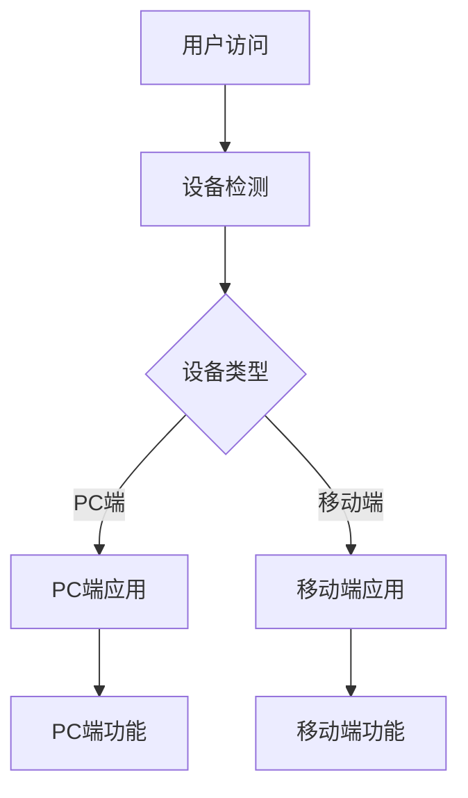

## 1. 产品概述

本项目旨在将现有的文本视觉生成应用进行移动端分离，创建独立的移动端项目，同时移除PC端的移动适配代码，实现更好的用户体验和代码维护性。

- 解决现有项目中PC端和移动端代码耦合的问题，提升各端的用户体验
- 为移动端用户提供专门优化的界面和交互体验
- 提高代码的可维护性和开发效率

## 2. 核心功能

### 2.1 用户角色

| 角色 | 访问方式 | 核心权限 |
|------|----------|----------|
| PC端用户 | 桌面浏览器访问 | 完整的文本视觉生成功能，大屏幕优化界面 |
| 移动端用户 | 移动设备浏览器访问 | 相同功能但移动端优化的界面和交互 |

### 2.2 功能模块

本项目包含以下主要页面和功能：

1. **PC端代码优化**：移除所有移动端适配代码，优化PC端体验
2. **移动端项目创建**：在mobile目录创建独立的移动端应用
3. **设备检测与跳转**：自动识别设备类型并跳转到对应版本
4. **功能同步**：确保移动端具备PC端的所有核心功能
5. **移动端UI优化**：专为移动设备设计的界面和交互

### 2.3 页面详情

| 页面名称 | 模块名称 | 功能描述 |
|----------|----------|----------|
| PC端首页 | 移动适配移除 | 移除所有sm:、md:等响应式类名，优化PC端布局 |
| PC端生成页面 | 移动适配清理 | 移除移动端相关CSS和JavaScript逻辑 |
| PC端模板页面 | 响应式代码清理 | 移除移动端hover优化和触摸相关代码 |
| 移动端首页 | 移动端框架搭建 | 使用Vant或类似框架创建移动端首页 |
| 移动端生成页面 | 触摸优化 | 针对移动端的文本输入和图片生成界面 |
| 移动端模板页面 | 手势交互 | 支持滑动、点击等移动端交互方式 |
| 设备检测页面 | 自动跳转逻辑 | 检测用户设备并自动跳转到对应版本 |

## 3. 核心流程

**PC端用户流程：**
用户通过桌面浏览器访问 → 设备检测确认为PC端 → 进入PC端应用 → 使用完整的PC端功能

**移动端用户流程：**
用户通过移动设备访问 → 设备检测确认为移动端 → 自动跳转到移动端应用 → 使用移动端优化的功能



## 4. 用户界面设计

### 4.1 设计风格

**PC端设计风格：**
- 主色调：保持现有的蓝色系（#3B82F6）和紫色系（#8B5CF6）
- 按钮样式：圆角按钮，保持现有的渐变效果
- 字体：Inter字体，16px基础字号
- 布局风格：卡片式布局，顶部导航
- 图标风格：线性图标，保持现有风格

**移动端设计风格：**
- 主色调：与PC端保持一致的蓝紫色系
- 按钮样式：更大的触摸区域，44px最小高度
- 字体：Inter字体，14px基础字号，适配移动端阅读
- 布局风格：底部导航，全屏卡片
- 图标风格：填充图标，更适合移动端识别

### 4.2 页面设计概览

| 页面名称 | 模块名称 | UI元素 |
|----------|----------|--------|
| PC端首页 | 清理后的布局 | 移除所有移动端媒体查询，保持大屏幕网格布局 |
| 移动端首页 | 移动端导航 | 底部Tab导航，大按钮，手势友好的卡片设计 |
| PC端生成页面 | 桌面端优化 | 侧边栏参数配置，大尺寸预览区域 |
| 移动端生成页面 | 触摸优化 | 全屏输入框，底部操作栏，滑动切换功能 |

### 4.3 响应式设计

- **PC端**：专注于桌面端体验，移除所有移动端适配代码
- **移动端**：专为移动设备设计，支持触摸交互和手势操作
- **设备检测**：JavaScript自动检测设备类型并跳转到对应版本

## 5. 技术选型

### 5.1 PC端技术栈（保持现有）
- **前端框架**：React 18 + TypeScript
- **构建工具**：Vite
- **样式方案**：Tailwind CSS（移除移动端相关类）
- **状态管理**：Zustand
- **路由**：React Router

### 5.2 移动端技术栈
- **前端框架**：React 18 + TypeScript
- **移动端UI框架**：Vant 4.x（专为移动端设计）
- **构建工具**：Vite
- **样式方案**：Vant主题 + 自定义CSS
- **状态管理**：Zustand（与PC端保持一致）
- **路由**：React Router
- **移动端优化**：
  - viewport设置
  - 触摸事件优化
  - 滚动优化
  - 图片懒加载

### 5.3 设备检测技术
- **检测方案**：User-Agent + 屏幕尺寸检测
- **跳转逻辑**：JavaScript重定向
- **域名方案**：
  - PC端：`https://your-domain.com`
  - 移动端：`https://m.your-domain.com` 或 `https://your-domain.com/mobile`

## 6. 架构设计

### 6.1 项目结构
```
d:\text-vison\text-vison\
├── front/                 # PC端项目（现有）
│   ├── src/
│   │   ├── components/    # 移除移动端适配代码
│   │   ├── pages/         # 清理响应式样式
│   │   └── styles/        # 移除mobile-*.css文件
│   └── package.json
├── mobile/                # 新建移动端项目
│   ├── src/
│   │   ├── components/    # 移动端专用组件
│   │   ├── pages/         # 移动端页面
│   │   ├── styles/        # 移动端样式
│   │   └── utils/         # 移动端工具函数
│   ├── package.json
│   └── vite.config.ts
└── shared/                # 共享代码（可选）
    ├── api/               # API接口定义
    ├── types/             # TypeScript类型
    └── utils/             # 通用工具函数
```

### 6.2 代码共享策略
- **API层**：PC端和移动端共享相同的API接口
- **业务逻辑**：核心业务逻辑通过共享的store和utils复用
- **组件**：UI组件完全分离，不共享
- **样式**：完全独立的样式系统

## 7. 实施步骤

### 7.1 第一阶段：PC端代码清理（1-2天）
1. **移除移动端CSS文件**
   - 删除 `mobile-optimization.css`
   - 删除 `mobile-fixes.css`
   - 删除 `mobile-button-fixes.css`
   - 删除 `hover-optimization.css` 中的移动端部分

2. **清理组件中的响应式代码**
   - 移除所有 `sm:`、`md:`、`lg:` 等Tailwind响应式前缀
   - 删除 `@media` 查询
   - 移除 `isMobile` 相关的JavaScript逻辑
   - 清理触摸事件处理代码

3. **优化PC端布局**
   - 固定为桌面端布局
   - 优化大屏幕显示效果
   - 移除不必要的响应式容器

### 7.2 第二阶段：移动端项目搭建（2-3天）
1. **创建移动端项目结构**
   ```bash
   cd d:\text-vison\text-vison
   mkdir mobile
   cd mobile
   npm create vite@latest . -- --template react-ts
   npm install vant @vant/touch-emulator
   ```

2. **配置移动端开发环境**
   - 配置Vite构建工具
   - 设置移动端viewport
   - 配置Vant UI组件库
   - 设置移动端专用的开发服务器端口

3. **创建基础页面结构**
   - 首页（Home）
   - 生成页面（Generate）
   - 模板页面（Templates）
   - 历史记录页面（History）
   - 设置页面（Settings）

### 7.3 第三阶段：移动端功能实现（3-4天）
1. **移植核心功能**
   - 文本输入和图片生成
   - 模板选择和使用
   - 历史记录查看
   - 参数配置

2. **移动端UI优化**
   - 底部导航栏
   - 触摸友好的按钮和输入框
   - 滑动和手势支持
   - 移动端适配的弹窗和提示

3. **性能优化**
   - 图片懒加载
   - 虚拟滚动（如需要）
   - 代码分割
   - 缓存策略

### 7.4 第四阶段：设备检测和跳转（1天）
1. **实现设备检测逻辑**
   ```javascript
   function isMobileDevice() {
     return /Android|webOS|iPhone|iPad|iPod|BlackBerry|IEMobile|Opera Mini/i.test(navigator.userAgent) 
            || window.innerWidth <= 768;
   }
   ```

2. **配置自动跳转**
   - 在PC端入口添加检测代码
   - 移动端访问PC端时自动跳转
   - 提供手动切换选项

### 7.5 第五阶段：测试和优化（1-2天）
1. **功能测试**
   - PC端功能完整性测试
   - 移动端功能对比测试
   - 跨设备跳转测试

2. **性能测试**
   - 移动端加载速度测试
   - 触摸响应测试
   - 内存使用测试

3. **兼容性测试**
   - 不同移动设备测试
   - 不同浏览器测试
   - iOS/Android兼容性测试

## 8. 注意事项

### 8.1 开发注意事项
- **代码分离**：确保PC端和移动端代码完全独立，避免相互影响
- **API兼容**：保持API接口的一致性，便于后续维护
- **样式隔离**：移动端使用独立的样式系统，避免样式冲突
- **状态管理**：考虑PC端和移动端状态管理的差异

### 8.2 用户体验注意事项
- **功能一致性**：确保移动端具备PC端的所有核心功能
- **交互优化**：针对移动端优化触摸交互和手势操作
- **性能优化**：移动端需要更严格的性能优化
- **离线支持**：考虑移动端的网络不稳定情况

### 8.3 部署注意事项
- **域名配置**：配置PC端和移动端的域名或路径
- **CDN优化**：针对移动端优化资源加载
- **缓存策略**：设置合适的缓存策略
- **监控告警**：设置PC端和移动端的独立监控